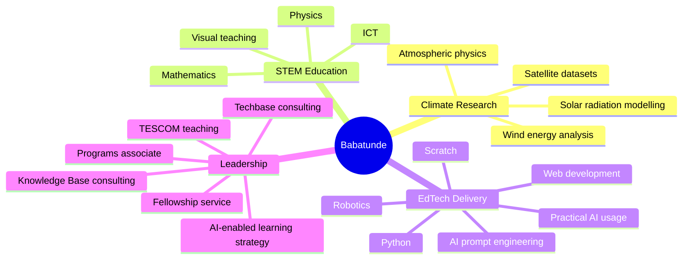
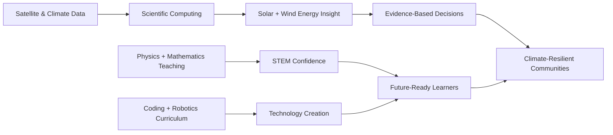

[](https://babatundeawo.github.io/)

[](https://git.io/typing-svg)

[](mailto:babatundeawoyemi91@gmail.com) [](https://www.linkedin.com/in/ba-awoyemi/) [](https://x.com/ba_awoyemi) [](https://www.instagram.com/ba_awoyemi/) [](https://web.facebook.com/ba.awoyemi) [](https://www.threads.com/@ba_awoyemi) [](https://wa.me/2348126909498) [](https://scratch.mit.edu/users/DeCreed/) [](https://babatundeawo.github.io/)


[](https://github.com/babatundeawo) [](https://github.com/babatundeawo) [](https://github.com/babatundeawo) [](https://github.com/babatundeawo)

---

## 👋 Hello — I am Babatunde

**Babatunde Ayoola Awoyemi** is a Nigerian **Atmospheric Physicist**, **STEM Educator**, **EdTech Consultant**, **coding and robotics trainer**, and **climate-energy researcher** from Ibadan, Oyo State.

My story blends curiosity, discipline and service: early hands-on exploration with radios and televisions sparked a lasting desire to understand how systems work. Today, that same exploratory spirit drives my mission to help learners, schools and research teams move from **technology awareness** to **technology creation**.

| 🌍 Climate | 🎓 Teaching | 🤖 EdTech | 🧠 Research |
|---|---|---|---|
| Solar radiation, atmospheric modelling, remote sensing and renewable energy assessment. | Physics, Mathematics, ICT, learner-centred pedagogy and visual scientific explanation. | Python, Scratch, robotics, coding clubs, curriculum design and STEM programme delivery. | Satellite datasets, all-sky irradiance, Weibull wind modelling and tropical climate systems. |

---

## 🧭 Explore This Profile

- [Snapshot](#-snapshot)
- [Life, Values & Origin Story](#-life-values--origin-story)
- [Education Timeline](#-education-timeline)
- [Research Portfolio & Publications](#-research-portfolio--publications)
- [Professional Experience](#-professional-experience)
- [GitHub Repositories](#-github-repositories)
- [Certifications, Programs & Recognition](#-certifications-programs--recognition)
- [Technical Skills](#-technical-skills)
- [Personal Interests & Philosophy](#-personal-interests--philosophy)
- [Collaboration Opportunities](#-collaboration-opportunities)
- [GitHub Analytics](#-github-analytics)
- [Connect](#-connect)

---

## ⚡ Snapshot

```yaml
name: Babatunde Ayoola Awoyemi
born: 17 September 1991, Ibadan, Oyo State, Nigeria
current_base: Nigeria
identity:
  - Atmospheric Physicist
  - STEM Educator
  - EdTech Consultant
  - Climate and Renewable Energy Researcher
  - Coding, Robotics and ICT Trainer
  - AI Prompt Engineering and Practical AI Usage Advocate
current_roles:
  - STEM Teacher, Oyo State TESCOM, Ilado/Sagbo Community Secondary School, Iseyin
  - Lead Consultant, Knowledge Base International Schools, Apapa, Moniya, Ibadan
  - Lead Consultant, Techbase Consulting Services
  - Programs Associate, STEM for Development
academic_path:
  - B.Sc. Physics, University of Ibadan, 2014
  - M.Sc. Physics / Atmospheric Physics, University of Ibadan, 2019
  - PGCE Secondary Physics with QTS (11–16), University of Cumbria — starting September 2026
research_focus:
  - Advanced solar radiation modelling across tropical regions
  - Satellite-derived direct irradiance under all-sky conditions
  - Wind speed distribution and wind energy potential in Nigeria
  - Climate dynamics, remote sensing and energy-environment systems
teaching_stack:
  - Physics · Mathematics · ICT
  - Python · Scratch · Web development (HTML, CSS, JS)
  - Robotics · AI prompt engineering · Practical AI usage
core_mission: "Serve society through STEM education, climate research and practical technology empowerment."
```

---

## 🌱 Life, Values & Origin Story

| 🏡 Background | 🔧 Early Curiosity |
|---|---|
| Born on **17 September 1991** in **Ibadan, Oyo State, Nigeria**. Shaped by values of discipline, calmness, simplicity and service. Draws on personal experience to teach with empathy, clarity and practical relevance. | Explored the inner workings of transistor radios and televisions from childhood. Built a self-directed learning habit through trial, error and experimentation. Carried early technical curiosity into climate modelling, coding education and robotics training. Embraces the creative range of a scientific **"jack of all trades"**. |

> I believe science becomes most powerful when it leaves the textbook, enters the classroom, informs policy, strengthens communities and gives learners the courage to build.

---

## 🎓 Education Timeline

| Stage | Institution | Years / Date | Highlights |
|---|---|---|---|
| **Primary Education** | Ronk New Age Nursery and Primary School, Akobo, Ibadan | 1994–2002 | Built early habits of diligence, sportsmanship and academic curiosity. |
| **Secondary Education** | Federal Government College, Ogbomoso | 2002–2008 | Boarding-school formation; earned the nickname **"Tunspiderman"** after dramatizing the *Spider-Man* trilogy for peers. |
| **B.Sc. Physics** | University of Ibadan | 2009–2014 | Transformed an earlier dislike for Physics into university-level strength. |
| **M.Sc. Physics — Atmospheric Physics** | University of Ibadan | Completed March 2019 | Focused on solar irradiance estimation and atmospheric datasets. Published 2020. |
| **PGCE Secondary Physics with QTS (11–16)** | University of Cumbria, Lancaster Campus | Starting September 2026 | Strengthening pedagogy and classroom practice for secondary Physics education. |

---

## 🔬 Research Portfolio & Publications

| Research Theme | Methods & Tools | Output / Status |
|---|---|---|
| ☀️ Solar dynamics | Solar structure, variability analysis, space-weather context | ICRERA-prepared manuscript under review |
| 🌤️ All-sky direct irradiance | Satellite datasets, cloud transmittance, atmospheric parameters | Published in *Bulletin of the Science Association of Nigeria* (2020) |
| 🌬️ Wind energy potential | Weibull distribution, statistical wind-speed analysis | Published in *Journal of Science and Technology* (2022) |
| 🛰️ Tropical solar radiation modelling | Satellite data from 2000–2025, climate dynamics, advanced modelling | PhD proposal direction |

### 🌤️ Parametric Estimation of Direct Irradiance under All-Sky Conditions from Publicly Available Satellite Datasets

**M.Sc. Project · University of Ibadan · Published 2020**  
**Publication:** *Bulletin of the Science Association of Nigeria*.

- Developed a practical approach for estimating direct irradiance under all-sky atmospheric conditions.
- Used publicly available satellite datasets to address limited ground-measurement coverage.
- Contributed to solar-resource assessment for data-scarce tropical and developing regions.
- Connected atmospheric physics with renewable energy planning and climate-informed decision-making.

### 🌬️ Statistical Analysis of Wind Speed Distribution and Wind Energy Potential in Nigeria Using the Weibull Distribution Model

**Wind Energy Research · Published 2022**  
**Publication:** *Journal of Science and Technology*; further prepared for the *International Journal of Energy and Environmental Engineering*.

- Modelled wind-speed distributions using Weibull-based statistical methods.
- Assessed wind-energy potential across Nigerian contexts, supporting renewable energy feasibility analysis.

### ☀️ Investigating Solar Dynamics: Unveiling the Intricacies of Solar Structure and Variability

**Undergraduate Project · University of Ibadan**  
**Publication Status:** Prepared for / under review by the **International Conference on Renewable Energy Research and Applications (ICRERA)**.

- Explored solar structure, variability and the wider implications of solar dynamics.
- Built an early research foundation in physics-based modelling and renewable-energy relevance.

### 🧪 PhD Research Direction

**Advanced Solar Radiation Modelling Across Tropical Regions Using Satellite Data (2000–2025)**

- Proposed doctoral research on solar radiation modelling in tropical environments.
- Focuses on satellite-derived atmospheric variables, radiative transfer, climate dynamics and validation workflows.
- Long-term goal: produce decision-ready solar-energy and climate-risk insights for data-scarce regions.

---

## 💼 Professional Experience

### 🏫 Oyo State Post Primary Teaching Service Commission — STEM Teacher
**January 2025 – Present · Ilado/Sagbo Community Secondary School, Iseyin**
- Teach **Physics, Mathematics and ICT** at the secondary-school level.
- Translate scientific concepts into practical explanations, visual demonstrations and learner-centred activities.

### 🧭 [Techbase Consulting Services](https://techbasengr.com.ng) — Lead Consultant
**January 2022 – Present · Registered STEM Education & Consultancy Business**
- Lead a consultancy focused on STEM education, coding, robotics, school support and technology-enabled learning.
- Design learning experiences in **Python, Scratch, HTML, CSS, JavaScript, robotics and physical computing**.
- Provide schools with STEM programme strategy, curriculum development, teacher support and learner project pathways.

### 🧭 [Knowledge Base International Schools](https://kbischools.com.ng) — Lead Consultant
**January 2022 – Present · Apapa, Moniya, Ibadan**
- Serve as lead consultant for STEM, ICT, coding and robotics learning pathways.
- Support school leadership with technology-enabled learning strategy, teacher guidance and student project development.

### 🚀 Techbridge Consulting Limited — Head of Training and Programs
**2017–2022**
- Directed robotics, coding and digital-skills programmes for learners and institutions.
- Developed curricula for **Python, Scratch and web development**.
- Led training systems that strengthened company growth, learner reach and programme delivery outcomes.

### 🇳🇬 Federal Government NTeach Programme — Physics & ICT Instructor
**2016–2019**
- Delivered secondary-level Physics and ICT instruction through the Federal Government's NTeach initiative.

### 📊 International Institute of Tropical Agriculture — Data Analyst
**2015–2016**
- Analysed agricultural and climate-related datasets using **SPSS**.
- Supported reports connected to climate resilience and agricultural development in West Africa.

### 🎖️ National Youth Service Corps — Teacher & Fellowship President
**2014–2015 · Akwa Ibom State**
- Awarded a certificate of recognition for exemplary work.
- Served as **President of the Redeemed Christian Corpers' Fellowship (RCCF)** in Ikot-Ekpene.

---

## 📁 GitHub Repositories

### 👤 Personal Account — [babatundeawo](https://github.com/babatundeawo)

| Repository | Description | Stack |
|---|---|---|
| 🌐 [babatundeawo.github.io](https://babatundeawo.github.io/) | Personal portfolio site — atmospheric physics, STEM, research and experience | HTML · CSS · JS |
| ✦ [ai-prompt-library](https://github.com/babatundeawo/ai-prompt-library) | 217 curated AI prompts across 11 categories — searchable, editable, one-click copy | HTML |
| 🌍 [globalwarming](https://github.com/babatundeawo/globalwarming) | Educational resource on global warming and climate change | HTML |
| 🎮 [python-games](https://github.com/babatundeawo/python-games) | 8 Python desktop games — DriveSim, Space Shooter, Snake, Flappy Bird, Hangman Pro, Mastermind, Wordle, Enchanted Word Weaver | Python · Pygame · Tkinter |
| 🖥️ [python-tkinter-apps](https://github.com/babatundeawo/python-tkinter-apps) | 19 desktop utility apps — expense tracker, grade master, bank manager, loan approver, task tracker and more | Python · Tkinter |
| 🌐 [python-web-projects](https://github.com/babatundeawo/python-web-projects) | Flask and SQL web applications with templated frontends | Python · Flask · SQL |

### 🏢 Organisation — [techbaseng](https://github.com/techbaseng)

| Repository | Description | Stack |
|---|---|---|
| 🌐 [techbaseng.github.io](https://github.com/techbaseng/techbaseng.github.io) | Techbase Consulting Services organisation landing page | HTML · CSS |
| 🐍 [techbase-python](https://github.com/techbaseng/techbase-python) | Python curriculum for students — beginner to Tkinter GUI, including step-by-step lesson files | Python |
| 🌐 [techbase-html](https://github.com/techbaseng/techbase-html) | HTML curriculum and learning resources for STEM students | HTML |
| 🎨 [techbase-css](https://github.com/techbaseng/techbase-css) | CSS curriculum and styling exercises for STEM students | CSS |
| ⚡ [techbase-js](https://github.com/techbaseng/techbase-js) | JavaScript curriculum resources for STEM learners | JavaScript |
| 🐱 [techbase-scratch](https://github.com/techbaseng/techbase-scratch) | Scratch programming resources, lesson plans and project guides | Scratch |
| 🤖 [techbase-robotics](https://github.com/techbaseng/techbase-robotics) | Robotics training resources, Arduino guides and hardware project documentation | Arduino · Robotics |

### 🏢 Organisation — [adeotioladejo](https://github.com/adeotioladejo)

| Repository | Description | Stack |
|---|---|---|
| 🌐 [adeotioladejo.github.io](https://github.com/adeotioladejo/adeotioladejo.github.io) | Client organisation site | HTML · CSS |

---

## 🏆 Certifications, Programs & Recognition

**🧑‍💼 Leadership & Impact**
- **STEM for Development** — selected as Programs Associate.
- **YALI RLC West Africa** Leadership Certification — 2024/2025.
- **LEAP Africa** volunteer certification for SDG-focused community projects, August 2021.
- **Healing Lives Initiative** certificate of appreciation for supporting Rise Conference 1.0, July 2024.

**💡 Design Thinking**
- **Australian Computing Academy** — Certificate of Mastery, DT Mini Challenge: Space Invaders with Blockly.
- **Cartedo** — Design Thinking Certification: COVID-19 Response.
- **Unilever Level-Up 2.0** — Design Thinking from a Business Perspective, January 2025.

**🌐 Web, ICT & Creative Technology**
- **Coursera** — Build a Full Website using WordPress, February 2021.
- **Coursera / University of Michigan** — Introduction to HTML5, February 2021.
- **SoloLearn** — HTML, CSS, Coding Foundations and Tech for Everyone, 2020–2024.
- **LinkedIn Learning** — What is Graphic Design?, August 2021.
- **Hour of Code** — Certificate of Completion.

**🎖️ Awards & Recognition**
- **RCCG Merit Award** — Most Outstanding Worker, Greatness Pinnacle Youth Church, 2013–2014.

---

## 🛠 Technical Skills

### Scientific Computing, Climate & Data

[](https://github.com/babatundeawo) [](https://github.com/babatundeawo) [](https://github.com/babatundeawo) [](https://github.com/babatundeawo) [](https://github.com/babatundeawo) [](https://github.com/babatundeawo)

### Web, Coding & Digital Learning

[](https://github.com/babatundeawo) [](https://github.com/babatundeawo) [](https://github.com/babatundeawo) [](https://github.com/babatundeawo) [](https://github.com/babatundeawo) [](https://github.com/babatundeawo) [](https://github.com/babatundeawo) [](https://github.com/babatundeawo)

### Robotics, Programme Design & Teaching

[](https://github.com/babatundeawo) [](https://github.com/babatundeawo) [](https://github.com/babatundeawo) [](https://github.com/babatundeawo) [](https://github.com/babatundeawo)



---

## 🎮 Personal Interests & Philosophy

| 🎮 Games & Simulation | 📸 Travel & Photography | ⚽ Football & Debate |
|---|---|---|
| I enjoy simulation and racing experiences such as **Euro Truck Simulator** and **Need for Speed**, where systems thinking, navigation and strategy meet entertainment. | I value photography and travelling as ways to observe people, places, landscapes, infrastructure and environmental realities. | I enjoy football and thoughtful arguments grounded in scientific documentaries, evidence and curiosity. |

- I believe good governance is essential to freeing Africa from tyranny and unlocking human potential.
- I support civic consciousness, including the spirit of the **#ENDSARS** movement.
- I describe myself as a deep thinker who prefers purposeful simplicity over noise.
- I learned programming largely through self-directed trial and error — an expensive journey that even cost me two damaged laptops.

---

## 🤝 Collaboration Opportunities

I am open to research support, speaking engagements, STEM partnerships, school programmes, curriculum collaborations and community-impact projects.

| 🌍 Climate, Solar & Energy Research | 🎓 STEM, Coding & Robotics Education |
|---|---|
| Solar radiation and direct irradiance modelling. Remote-sensing workflows for data-scarce regions. Wind-energy potential studies using statistical distributions. Climate dynamics and tropical atmospheric modelling. Research proposal development and literature synthesis. | Physics, Mathematics and ICT intervention programmes. Scratch, Python, HTML/CSS and beginner JavaScript curricula. AI prompt engineering and responsible practical AI usage for learning workflows. Robotics clubs, school STEM labs and project showcases. Teacher training and institutional STEM strategy. Digital-skills bootcamps for learners and communities. |

---

## 📊 GitHub Analytics

[](https://github.com/babatundeawo) [](https://github.com/babatundeawo)

[](https://github.com/babatundeawo)

[](https://github.com/babatundeawo)

---

## 📌 Signature Value Proposition

> I help students, schools and institutions turn scientific curiosity into practical capability — connecting **climate research**, **STEM education**, **coding**, **robotics** and **good governance-minded service** for a more informed and resilient society.



---

## 📫 Connect

| Channel | Link |
|---|---|
| 📧 Email | babatundeawoyemi91@gmail.com |
| 💬 WhatsApp | [+234 812 690 9498](https://wa.me/2348126909498) |
| 💼 LinkedIn | [ba-awoyemi](https://www.linkedin.com/in/ba-awoyemi/) |
| 🐦 X | [@ba_awoyemi](https://x.com/ba_awoyemi) |
| 📸 Instagram | [@ba_awoyemi](https://www.instagram.com/ba_awoyemi/) |
| 🧵 Threads | [@ba_awoyemi](https://www.threads.com/@ba_awoyemi) |
| 📘 Facebook | [ba.awoyemi](https://web.facebook.com/ba.awoyemi) |
| 🧩 Scratch | [DeCreed](https://scratch.mit.edu/users/DeCreed/) |
| 🧑‍💻 GitHub Portfolio | [babatundeawo.github.io](https://babatundeawo.github.io/) |

---

[](https://babatundeawo.github.io/)

**"What ultimately matters is not where you end up relative to others, but where you end up relative to yourself when you began."**  
Built around service, scientific curiosity, disciplined learning and practical STEM impact.
