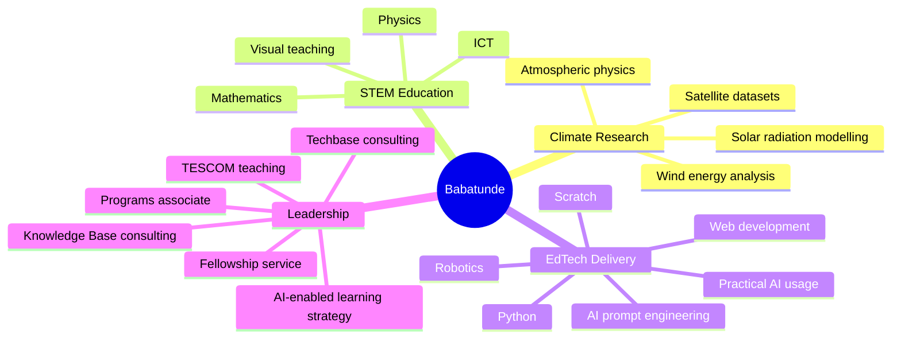
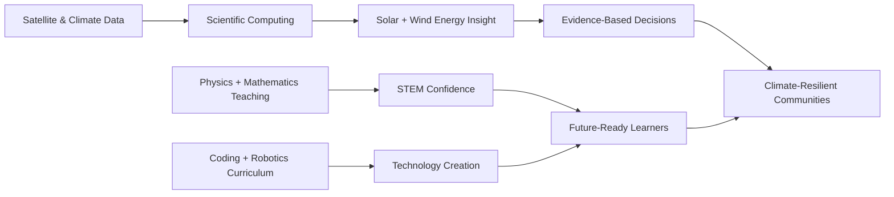

[](https://github.com/babatundeawo)

[](https://git.io/typing-svg)

[](mailto:babatundeawoyemi91@gmail.com)
[](https://www.linkedin.com/in/ba-awoyemi/)
[](https://x.com/ba_awoyemi)
[](https://www.youtube.com/@techbasengr)
[](https://wa.me/2348126909498)
[](https://scratch.mit.edu/users/DeCreed/)
[](https://babatundeawo.github.io/)

[](https://github.com/babatundeawo)
[]()
[]()
[]()

---

## 👋 Hello — I am Babatunde

**Babatunde Ayoola Awoyemi** is a Nigerian **Atmospheric Physicist**, **STEM Educator**, **EdTech Consultant**, **coding and robotics trainer**, and **climate-energy researcher**.

He works at the intersection of atmospheric physics and climate research on one side, and STEM education and technology training on the other — turning satellite datasets and scientific method into research insight, and into clear, hands-on learning systems for schools and learners.

| 🌍 Climate | 🎓 Teaching | 🤖 EdTech | 🧠 Research |
|---|---|---|---|
| Solar radiation, atmospheric modelling, remote sensing and renewable energy assessment. | Physics, Mathematics, ICT, learner-centered pedagogy and visual scientific explanation. | Python, Scratch, robotics, coding clubs, curriculum design and STEM program delivery. | Satellite datasets, all-sky irradiance, Weibull wind modelling and tropical climate systems. |

---

## 🧭 Explore This Profile

- [Snapshot](#-snapshot)
- [Education Timeline](#-education-timeline)
- [Research Portfolio & Publications](#-research-portfolio--publications)
- [Professional Experience](#-professional-experience)
- [Certifications, Programs & Recognition](#-certifications-programs--recognition)
- [Technical Skills](#-technical-skills)
- [Collaboration Opportunities](#-collaboration-opportunities)
- [Repository Directory](#-repository-directory)
- [GitHub Analytics](#-github-analytics)
- [Connect](#-connect)

---

## ⚡ Snapshot

```yaml
name: Babatunde Ayoola Awoyemi
current_base: Nigeria
identity:
  - Atmospheric Physicist
  - STEM Educator
  - EdTech Consultant
  - Climate and Renewable Energy Researcher
  - Coding, Robotics and ICT Trainer
  - AI Prompt Engineering and Practical AI Usage Advocate
current_roles:
  - Physics Instructor / STEM Educator, Oyo State TESCOM, Anglican Grammar School, Agbirigidi, Akinyele, Ibadan
  - Lead Consultant, Knowledge Base International Schools, Apapa, Moniya, Ibadan
  - Lead Consultant, Techbase Consulting Services
  - Programs Associate, STEM for Development
academic_path:
  - B.Sc. Physics, University of Ibadan, 2014
  - M.Sc. Physics / Atmospheric Physics, University of Ibadan
research_focus:
  - Advanced solar radiation modelling across tropical regions
  - Satellite-derived direct irradiance under all-sky conditions
  - Wind speed distribution and wind energy potential in Nigeria
  - Climate dynamics, remote sensing and energy-environment systems
teaching_stack:
  - Physics
  - Mathematics
  - ICT
  - Python
  - Scratch
  - Web development
  - Robotics
  - AI prompt engineering
  - Practical AI usage
core_mission: "Serve society through STEM education, climate research and practical technology empowerment."
```

---

## 🎓 Education Timeline

| Stage | Institution | Years / Date | Highlights |
| --- | --- | --- | --- |
| **Primary Education** | Ronk New Age Nursery and Primary School, Akobo, Ibadan | 1994–2002 | Built early habits of diligence, sportsmanship and academic curiosity. |
| **Secondary Education** | Federal Government College, Ogbomoso | 2002–2008 | Boarding-school formation that built resilience, independence and practical life skills. |
| **B.Sc. Physics** | University of Ibadan | 2009–2014 | Transformed an earlier dislike for Physics into university-level strength. |
| **M.Sc. Physics — Atmospheric Physics** | University of Ibadan | Completed March 2019 | Focused on solar irradiance estimation and atmospheric datasets. |

---

## 🔬 Research Portfolio & Publications

| Research Theme | Methods & Tools | Output / Status |
| --- | --- | --- |
| ☀️ Solar dynamics | Solar structure, variability analysis, space-weather context | ICRERA-prepared manuscript under review |
| 🌤️ All-sky direct irradiance | Satellite datasets, cloud transmittance, atmospheric parameters | Published in *Bulletin of the Science Association of Nigeria* (2020) |
| 🌬️ Wind energy potential | Weibull distribution, statistical wind-speed analysis | Published in *Journal of Science and Technology* (2022) |

### ☀️ Investigating Solar Dynamics: Unveiling the Intricacies of Solar Structure and Variability

**Undergraduate Project · University of Ibadan**
**Publication Status:** Prepared for / under review by the **International Conference on Renewable Energy Research and Applications (ICRERA)**.

- Explored solar structure, variability and the wider implications of solar dynamics.
- Built an early research foundation in physics-based modelling and renewable-energy relevance.
- Strengthened interest in climate-energy systems and scientific communication.

### 🌤️ Parametric Estimation of Direct Irradiance under All-Sky Conditions from Publicly Available Satellite Datasets

**M.Sc. Project · University of Ibadan · Published 2020**
**Publication:** *Bulletin of the Science Association of Nigeria*.

- Developed a practical approach for estimating direct irradiance under all-sky atmospheric conditions.
- Used publicly available satellite datasets to address limited ground-measurement coverage.
- Contributed to solar-resource assessment for data-scarce tropical and developing regions.
- Connected atmospheric physics with renewable energy planning and climate-informed decision-making.

### 🌬️ Statistical Analysis of Wind Speed Distribution and Wind Energy Potential in Nigeria Using the Weibull Distribution Model

**Wind Energy Research · Published 2022**
**Publication:** *Journal of Science and Technology*; further prepared for the *International Journal of Energy and Environmental Engineering*.

- Modelled wind-speed distributions using Weibull-based statistical methods.
- Assessed wind-energy potential across Nigerian contexts.
- Supported renewable energy feasibility analysis using data-driven atmospheric insight.

---

## 💼 Professional Experience

### 🏫 Oyo State Post Primary Teaching Service Commission — Physics Instructor / STEM Educator

**January 2025 – Present · Anglican Grammar School, Agbirigidi, Akinyele, Ibadan**

- Teach **Physics, Mathematics and ICT** at the secondary-school level.
- Translate scientific concepts into practical explanations, visual demonstrations and learner-centered activities.
- Support students with STEM confidence, problem-solving habits and digital-literacy foundations.

### 🧭 [Knowledge Base International Schools](https://kbischools.com.ng) — Lead Consultant

**January 2022 – Present · Apapa, Moniya, Ibadan**

- Serve as lead consultant for STEM, ICT, coding and robotics learning pathways.
- Support school leadership with technology-enabled learning strategy, teacher guidance and student project development.
- Help learners build confidence through practical, project-based digital-skills experiences.

### 🧭 [Techbase Consulting Services](https://techbasengr.com.ng) — Lead Consultant

**January 2022 – Present · Registered STEM Education & Consultancy Business**

- Lead a consultancy focused on STEM education, coding, robotics, school support and technology-enabled learning.
- Design learning experiences in **Python, Scratch, HTML, CSS, JavaScript, robotics and physical computing**.
- Provide schools with STEM program strategy, curriculum development, teacher support and learner project pathways.

### 🚀 Techbridge Consulting Limited — Head of Training and Programs

**2017–2022**

- Directed robotics, coding and digital-skills programs for learners and institutions.
- Developed curricula for **Python, Scratch and web development**.
- Led training systems that strengthened company growth, learner reach and program delivery outcomes.
- Built program structures connecting creativity, computation and measurable learning outcomes.

### 🇳🇬 Federal Government NTeach Programme — Physics & ICT Instructor

**2016–2019**

- Delivered secondary-level Physics and ICT instruction through the Federal Government's NTeach initiative.
- Supported learners with structured explanations, classroom technology and practical science engagement.

### 📊 International Institute of Tropical Agriculture — Data Analyst

**2015–2016**

- Analysed agricultural and climate-related datasets using **SPSS**.
- Supported reports connected to climate resilience and agricultural development in West Africa.
- Strengthened applied data-analysis experience in development, food systems and climate contexts.

### 🎖️ National Youth Service Corps — Teacher & Fellowship President

**2014–2015 · Akwa Ibom State**

- Awarded a certificate of recognition for exemplary work.
- Served as **President of a corps fellowship group** in Ikot-Ekpene.
- Managed housing coordination, interpersonal conflict resolution and service leadership for fellow corps members.

---

## 🏆 Certifications, Programs & Recognition

**🧑‍💼 Leadership & Impact**
- **STEM for Development** — selected as Programs Associate.
- **YALI RLC West Africa** Leadership Certification — 2024/2025.
- **LEAP Africa** volunteer certification for SDG-focused community projects, August 2021.
- **Healing Lives Initiative** certificate of appreciation for supporting Rise Conference 1.0, July 2024.

**💡 Design Thinking**
- **Australian Computing Academy** — Certificate of Mastery, DT Mini Challenge: Space Invaders with Blockly.
- **Cartedo** — Design Thinking Certification: COVID-19 Response.
- **Unilever Level-Up 2.0** — Design Thinking from a Business Perspective, January 2025.

**🌐 Web, ICT & Creative Technology**
- **Coursera** — Build a Full Website using WordPress, February 2021.
- **Coursera / University of Michigan** — Introduction to HTML5, February 2021.
- **SoloLearn** — HTML, CSS, Coding Foundations and Tech for Everyone, 2020–2024.
- **LinkedIn Learning** — What is Graphic Design?, August 2021.
- **Hour of Code** — Certificate of Completion.

---

## 🛠 Technical Skills

### Scientific Computing, Climate & Data


### Web, Coding & Digital Learning


### Robotics, Program Design & Teaching




---

## 🤝 Collaboration Opportunities

I am open to research support, speaking engagements, STEM partnerships, school programs, curriculum collaborations and community-impact projects.

| 🌍 Climate, Solar & Energy Research | 🎓 STEM, Coding & Robotics Education |
|---|---|
| Solar radiation and direct irradiance modelling. Remote-sensing workflows for data-scarce regions. Wind-energy potential studies using statistical distributions. Climate dynamics and tropical atmospheric modelling. Research proposal development and literature synthesis. | Physics, Mathematics and ICT intervention programs. Scratch, Python, HTML/CSS and beginner JavaScript curricula. AI prompt engineering and responsible practical AI usage for learning workflows. Robotics clubs, school STEM labs and project showcases. Teacher training and institutional STEM strategy. Digital-skills bootcamps for learners and communities. |

## 🗂 Repository Directory

Every public repository across my personal account and the two organisations I build under — grouped by
account so it is clear what lives where. Profile repos (the special `.github` / username repos that render
each account's About page) are listed separately at the end.

### 👤 Personal — [github.com/babatundeawo](https://github.com/babatundeawo)

| Project | What it is | Live | Code |
| --- | --- | --- | --- |
| 🧑‍💻 Portfolio site | This profile's full portfolio — about, education, research, experience, projects. | [Visit →](https://babatundeawo.github.io/) | [Code →](https://github.com/babatundeawo/babatundeawo.github.io) |
| 🌍 Global Warming Explorer | 27-page interactive climate-science learning site with a guided course and classroom check-in dashboard. | [Visit →](https://babatundeawo.github.io/globalwarming/) | [Code →](https://github.com/babatundeawo/globalwarming) |
| 🧠 PromptOS — AI Prompt Library | 217 curated AI prompts across 11 categories, searchable and editable, works offline. | [Visit →](https://babatundeawo.github.io/ai-prompt-library/) | [Code →](https://github.com/babatundeawo/ai-prompt-library) |
| 🗂️ Deploybase — AI Deployment Directory | Registry of every deployed Claude Project built and run by Techbase / Babatunde Awoyemi. | [Visit →](https://babatundeawo.github.io/deploybase/) | [Code →](https://github.com/babatundeawo/deploybase) |
| 🧑‍🏫 Educator AI Toolkit | Free reference site for Nigerian educators — exam/marking-guide and lesson-note AI generators. | [Visit →](https://babatundeawo.github.io/educator-ai-toolkit/) | [Code →](https://github.com/babatundeawo/educator-ai-toolkit) |
| 📱 AI Studio → Android Deployment Guide | 23-step guide to shipping a Google AI Studio app as an installable Android PWA. | [Visit →](https://babatundeawo.github.io/ai-studio-android-guide/) | [Code →](https://github.com/babatundeawo/ai-studio-android-guide) |
| 🧾 Personal AI Career Engine | Free guide to building CV & career documents with NotebookLM and a configured Claude Project. | [Visit →](https://babatundeawo.github.io/career-engine-guide/) | [Code →](https://github.com/babatundeawo/career-engine-guide) |
| ✝️ Deep Calls | Long-form Christian apologetics essays, served from a custom Python static-site generator. | [Visit →](https://babatundeawo.github.io/deep-calls/) | [Code →](https://github.com/babatundeawo/deep-calls) |
| 🎉 Bible Family Feud | Interactive Bible-themed Family Feud game show for church events — 37 rounds, live scoring, no install needed. | [Visit →](https://babatundeawo.github.io/bible-family-feud/) | [Code →](https://github.com/babatundeawo/bible-family-feud) |
| ⛪ RCCG Training Portal | Interactive, mobile-first discipleship training portal replacing three printed RCCG manuals (Believers', Baptismal, Workers-in-Training) with guided lessons, scripture-reveal quizzes, and progress sync. | [Visit →](https://babatundeawo.github.io/rccg-training-portal/) | [Code →](https://github.com/babatundeawo/rccg-training-portal) |
| 🔤 Akinyele Spelling Challenge | Fully responsive static microsite documenting the 2026 Akinyele Spelling Challenge — event details, schools, results. | [Visit →](https://babatundeawo.github.io/akinyele-spelling-challenge/) | [Code →](https://github.com/babatundeawo/akinyele-spelling-challenge) |
| 💰 Millionaire Mindset | Personal-development app on wealth-building habits and mindset shifts — hosted on Replit rather than GitHub Pages. | [Visit →](https://replit.com/@ba-awoyemi/Millionaire-Mindset) | [Code →](https://github.com/babatundeawo/Millionaire-Mindset) |
| 🧮 Safe Calculator | Lightweight, browser-based calculator tool. Now maintained as a subfolder in the `personal-projects` monorepo. | — (code only) | [Code →](https://github.com/babatundeawo/personal-projects/tree/main/safe-calculator) |
| 👾 Regex Form & Secret Code Playground | Gamified regex-teaching app for kids and students, with a live sandbox and password-strength checker. Now maintained as a subfolder in the `personal-projects` monorepo. | — (code only) | [Code →](https://github.com/babatundeawo/personal-projects/tree/main/smart-form-validator) |
| 🏫 Student Report Card System | Self-contained, browser-based student information & performance management system for schools. Now maintained as a subfolder in the `personal-projects` monorepo. | — (code only) | [Code →](https://github.com/babatundeawo/personal-projects/tree/main/student-report-card) |
| 🏫 Ilado-Sagbo CGS Records Dashboard | Multi-page administrative dashboard preloaded with real school enrollment, results, staff & handover records — built for a local presentation to education officials. | [Visit →](https://babatundeawo.github.io/ilado-school-dashboard/) | [Code →](https://github.com/babatundeawo/ilado-school-dashboard) |

### 🎓 Techbase Consultant Services — [github.com/techbaseng](https://github.com/techbaseng)

| Repo | What it is | Live | Code |
| --- | --- | --- | --- |
| 🎓 Techbase STEM Academy (hub) | Course index & landing page for all six free courses. | [Visit →](https://techbaseng.github.io/) | [Code →](https://github.com/techbaseng/techbaseng.github.io) |
| 🌐 HTML Fundamentals | Beginner course, 34 lessons. | [Visit →](https://techbaseng.github.io/techbase-html/) | [Code →](https://github.com/techbaseng/techbase-html) |
| 🎨 CSS Styling | Beginner → Advanced course, 73 lessons. | [Visit →](https://techbaseng.github.io/techbase-css/) | [Code →](https://github.com/techbaseng/techbase-css) |
| ⚡ JavaScript | Intermediate course, 46 lessons. | [Visit →](https://techbaseng.github.io/techbase-js/) | [Code →](https://github.com/techbaseng/techbase-js) |
| 🐍 Python Programming | Beginner → Advanced course, 45 lessons. | [Visit →](https://techbaseng.github.io/techbase-python/) | [Code →](https://github.com/techbaseng/techbase-python) |
| 🟠 Scratch Programming | Beginner course, 35 projects. | [Visit →](https://techbaseng.github.io/techbase-scratch/) | [Code →](https://github.com/techbaseng/techbase-scratch) |
| 🤖 Robotics & micro:bit | 123 official BBC micro:bit projects, Beginner → Advanced. | [Visit →](https://techbaseng.github.io/techbase-robotics/) | [Code →](https://github.com/techbaseng/techbase-robotics) |

### 🏫 Knowledge Base International Schools — [github.com/kbischool](https://github.com/kbischool)

| Repo | What it is | Live | Code |
| --- | --- | --- | --- |
| 💳 School Fee Payment Portal | Secure, private school-fee lookup portal for parents, by unique family code — no personal data stored client-side. | [Visit →](https://kbischool.github.io/school-fee-portal/) | [Code →](https://github.com/kbischool/school-fee-portal) |
| 🧾 KBIS Records | Mobile-first, installable student records & billing app — browse enrollment, terms and itemised account breakdowns, built from the school's fee workbooks. | [Visit →](https://kbischool.github.io/kbis-records/) | [Code →](https://github.com/kbischool/kbis-records) |

### 📇 Profile repos

The special repos whose README renders each account's About page — not projects in themselves.

| Account | Repo | Renders |
| --- | --- | --- |
| Personal | [babatundeawo/babatundeawo](https://github.com/babatundeawo/babatundeawo) | [github.com/babatundeawo](https://github.com/babatundeawo) |
| Techbase Consultant Services | [techbaseng/.github](https://github.com/techbaseng/.github) | [github.com/techbaseng](https://github.com/techbaseng) |
| Knowledge Base International Schools | [kbischool/.github](https://github.com/kbischool/.github) | [github.com/kbischool](https://github.com/kbischool) |

---

## 📊 GitHub Analytics

[](https://github.com/babatundeawo/babatundeawo)

[](https://github.com/babatundeawo/babatundeawo)

[](https://github.com/babatundeawo/babatundeawo)


[](https://github.com/babatundeawo/babatundeawo)

---

## 📌 Signature Value Proposition

> I help students, schools and institutions turn scientific curiosity into practical capability — connecting **climate research**, **STEM education**, **coding**, **robotics** and **community-focused service** for a more informed and resilient society.



---

## 📫 Connect

| Channel | Link |
| --- | --- |
| 📧 Email | <babatundeawoyemi91@gmail.com> |
| 💬 WhatsApp | [+234 812 690 9498](https://wa.me/2348126909498) |
| 💼 LinkedIn | [ba-awoyemi](https://www.linkedin.com/in/ba-awoyemi/) |
| 🐦 X | [@ba_awoyemi](https://x.com/ba_awoyemi) |
| 📺 YouTube | [@techbasengr](https://www.youtube.com/@techbasengr) |
| 🧩 Scratch | [DeCreed](https://scratch.mit.edu/users/DeCreed/) |
| 🧑‍💻 GitHub Portfolio | [babatundeawo.github.io](https://babatundeawo.github.io/) |

---

[](https://github.com/babatundeawo)

**"What ultimately matters is not where you end up relative to others, but where you end up relative to yourself when you began."**
Built around service, scientific curiosity, disciplined learning and practical STEM impact.
