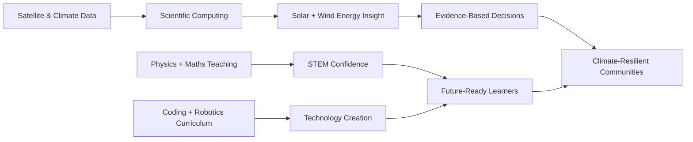

[](https://babatundeawo.github.io/)

[](https://git.io/typing-svg)

[](mailto:babatundeawoyemi91@gmail.com) [](https://www.linkedin.com/in/ba-awoyemi/) [](https://wa.me/2348126909498) [](https://x.com/ba_awoyemi) [](https://www.instagram.com/ba_awoyemi/) [](https://www.threads.com/@ba_awoyemi) [](https://web.facebook.com/ba.awoyemi) [](https://babatundeawo.github.io/)

[](https://komarev.com/ghpvc/?username=babatundeawo) [](https://babatundeawo.github.io/) [](mailto:babatundeawoyemi91@gmail.com)

---

## 👋 Hello — I'm Babatunde

I'm a Nigerian **atmospheric physicist**, **STEM educator**, **EdTech consultant**, and **coding & robotics trainer**, based in Ibadan. My story blends curiosity and service: early hands-on exploration with radios and televisions sparked a lasting drive to understand how systems work — a drive I now point at solar radiation, climate data, and helping learners move from technology *awareness* to technology *creation*.

🌍 **Climate** — solar radiation, atmospheric modelling, remote sensing, renewable energy assessment.
🎓 **Teaching** — Physics, Mathematics, ICT, learner-centred pedagogy, visual scientific explanation.
🤖 **EdTech** — Python, Scratch, robotics, coding clubs, curriculum design, STEM programme delivery.

**Jump to:** [Snapshot](#-snapshot) · [Education](#-education) · [Research](#-research--publications) · [Experience](#-experience) · [Skills](#-technical-skills) · [Recognition](#-certifications--recognition) · [Interests](#-personal-interests--philosophy) · [Analytics](#-github-analytics) · [Connect](#-connect)

---

## ⚡ Snapshot

```yaml
name: Babatunde Ayoola Awoyemi
identity:
  - Atmospheric Physicist & Climate / Renewable Energy Researcher
  - STEM Educator & EdTech Consultant
  - Coding, Robotics and ICT Trainer
  - AI Prompt Engineering and Practical AI Usage Advocate
current_roles:
  - STEM Teacher, Oyo State TESCOM — Ilado/Sagbo Community Secondary School, Iseyin
  - Lead Consultant, Techbase Consulting Services
  - Lead Consultant, Knowledge Base International Schools, Apapa, Moniya, Ibadan
  - Programs Associate, STEM for Development
academic_path:
  - B.Sc. Physics, University of Ibadan
  - M.Sc. Physics / Atmospheric Physics, University of Ibadan
  - Secondary Physics teacher-training pathway (in progress)
core_mission: "Serve society through STEM education, climate research, and practical technology empowerment."
```

---

## 🎓 Education

| Stage | Institution | Highlights |
| --- | --- | --- |
| **B.Sc. Physics** | University of Ibadan | Turned an early dislike of secondary-school Physics into university-level strength. |
| **M.Sc. Physics — Atmospheric Physics** | University of Ibadan | Solar irradiance estimation and atmospheric datasets. Published 2020. |
| **Secondary Physics Teacher Training** | Professional pathway, in progress | Strengthening pedagogy and classroom practice for secondary Physics. |

---

## 🔬 Research & Publications

| Theme | Methods & Tools | Output |
| --- | --- | --- |
| ☀️ Solar dynamics | Solar structure & variability analysis | ICRERA-prepared manuscript |
| 🌤️ All-sky direct irradiance | Satellite datasets, cloud transmittance | *Bulletin of the Science Association of Nigeria* (2020) |
| 🌬️ Wind-energy potential | Weibull distribution, statistical analysis | *Journal of Science and Technology* (2022) |
| 🛰️ Tropical solar radiation modelling | Satellite data 2000–2025, climate dynamics | PhD proposal direction |

Full write-ups for each of these, including methods and findings, are on the [portfolio site →](https://babatundeawo.github.io/#research)

---

## 💼 Experience

| Role | Organisation | Period |
| --- | --- | --- |
| STEM Teacher | Oyo State TESCOM | Jan 2025 — Present |
| Lead Consultant | [Techbase Consulting Services](https://techbasengr.com.ng) | Jan 2022 — Present |
| Lead Consultant | [Knowledge Base International Schools](https://kbischools.com.ng) | Jan 2022 — Present |
| Head of Training & Programs | Techbridge Consulting Limited | 2017 — 2022 |
| Physics & ICT Instructor | Federal Government NTeach Programme | 2016 — 2019 |
| Data Analyst | International Institute of Tropical Agriculture (IITA) | 2015 — 2016 |
| Teacher & RCCF President | NYSC, Akwa Ibom State | 2014 — 2015 |

Across these roles: secondary Physics/Maths/ICT teaching, STEM and EdTech consultancy for schools, robotics and coding curriculum leadership, and climate-data analysis with SPSS for agricultural resilience in West Africa.

---

## 🏆 Certifications & Recognition

| Area | Credential | When |
| --- | --- | --- |
| Leadership | YALI RLC West Africa Leadership Certification | 2024/2025 |
| Leadership | STEM for Development — Programs Associate | Selected Feb 2026 |
| Leadership | LEAP Africa volunteer certification (SDG-focused projects) | Aug 2021 |
| Design thinking | Australian Computing Academy — Space Invaders w/ Blockly | — |
| Design thinking | Cartedo — COVID-19 Response | — |
| Design thinking | Unilever Level-Up 2.0 — Business Perspective | Jan 2025 |
| Web & ICT | Coursera / University of Michigan — WordPress & HTML5 | Feb 2021 |
| Web & ICT | SoloLearn — HTML, CSS, coding foundations | 2020 — 2024 |
| Web & ICT | LinkedIn Learning — Graphic Design · Hour of Code | Aug 2021 |
| Recognition | RCCG Merit Award — Most Outstanding Worker | 2013/2014 |
| Recognition | Healing Lives Initiative — appreciation, Rise Conference 1.0 | Jul 2024 |

---

## 🛠 Technical Skills

**Scientific computing, climate & data**

[]() []() []() []() []() []()

**Web, coding, robotics & teaching**

[]() []() []() []() []() []() []()

---

## 🎮 Personal Interests & Philosophy

🎮 **Simulation gaming** — *Euro Truck Simulator* and *Need for Speed*, where systems thinking and strategy meet entertainment.
📸 **Travel & photography** — observing people, places, and environmental realities up close.
⚽ **Football & debate** — thoughtful arguments grounded in scientific documentaries and curiosity.

> I believe good governance is essential to freeing Africa from tyranny and unlocking human potential. I'm a deep thinker who prefers purposeful simplicity over noise, and I learned programming largely through self-directed trial and error — a journey that cost me two damaged laptops along the way.

---

## 🤝 Collaboration Opportunities

| 🌍 Climate, Solar & Energy Research | 🎓 STEM, Coding & Robotics Education |
| --- | --- |
| Solar radiation and direct-irradiance modelling | Physics, Mathematics and ICT intervention programmes |
| Remote-sensing workflows for data-scarce regions | Scratch, Python, HTML/CSS and JavaScript curricula |
| Wind-energy potential studies | AI prompt engineering & practical AI for learning |
| Climate dynamics, tropical atmospheric modelling | Robotics clubs, school STEM labs, teacher training |

---

## 📊 GitHub Analytics

[](https://github.com/babatundeawo) [](https://github.com/babatundeawo)

[](https://github.com/babatundeawo)

---

## 📌 Signature Value Proposition

> I help students, schools and institutions turn scientific curiosity into practical capability — connecting **climate research**, **STEM education**, **coding**, **robotics**, and **good-governance-minded service** for a more informed, resilient society.



---

## 📫 Connect

| Channel | Link |
| --- | --- |
| 📧 Email | babatundeawoyemi91@gmail.com |
| 💬 WhatsApp | [+234 812 690 9498](https://wa.me/2348126909498) |
| 💼 LinkedIn | [ba-awoyemi](https://www.linkedin.com/in/ba-awoyemi/) |
| 🐦 X | [@ba_awoyemi](https://x.com/ba_awoyemi) |
| 📸 Instagram | [@ba_awoyemi](https://www.instagram.com/ba_awoyemi/) |
| 🧵 Threads | [@ba_awoyemi](https://www.threads.com/@ba_awoyemi) |
| 📘 Facebook | [ba.awoyemi](https://web.facebook.com/ba.awoyemi) |
| 🧩 Scratch | [DeCreed](https://scratch.mit.edu/users/DeCreed/) |
| 🧑‍💻 Portfolio | [babatundeawo.github.io](https://babatundeawo.github.io/) |
| 🏢 Techbase org | [github.com/techbaseng](https://github.com/techbaseng) |

---

[](https://babatundeawo.github.io/)

**"What ultimately matters is not where you end up relative to others, but where you end up relative to yourself when you began."**
Built around service, scientific curiosity, disciplined learning, and practical STEM impact.
