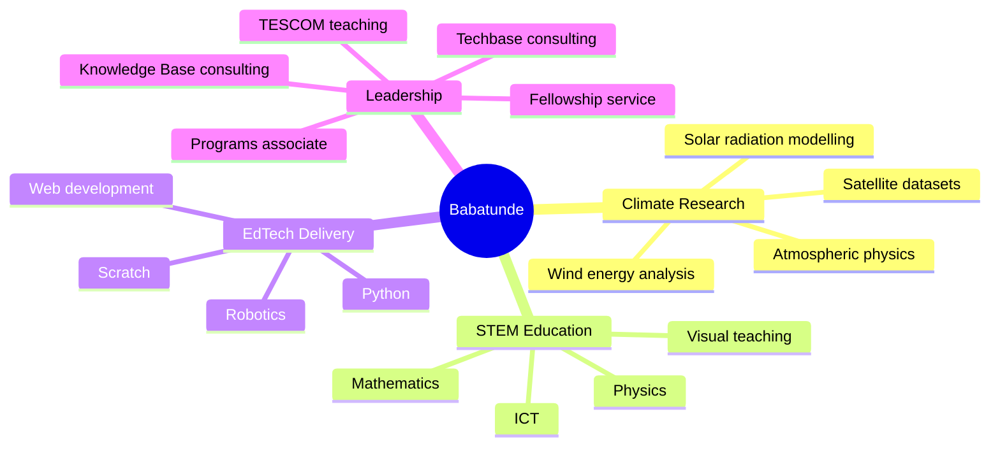
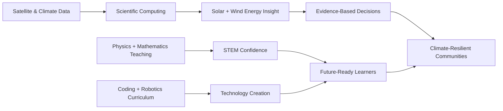

<!--
  Profile README for Babatunde Ayoola Awoyemi
  A modern, content-rich GitHub profile designed for clarity, credibility and visual impact.
-->

<div align="center">
  
</div>

<div align="center">

[](https://git.io/typing-svg)

</div>

<div align="center">
  <a href="mailto:babatundeawoyemi91@gmail.com"></a>
  <a href="https://www.linkedin.com/in/ba-awoyemi/"></a>
  <a href="https://x.com/ba_awoyemi"></a>
  <a href="https://www.instagram.com/ba_awoyemi/"></a>
  <a href="https://web.facebook.com/ba.awoyemi"></a>
  <a href="https://www.threads.com/@ba_awoyemi"></a>
  <a href="https://wa.me/2348126909498"></a>
  <a href="https://scratch.mit.edu/users/DeCreed/"></a>
</div>

<br />

<div align="center">
  
  
  
  
</div>

---

## 👋 Hello — I am Babatunde

**Babatunde Ayoola Awoyemi** — also known by the baptismal name **Samuel** — is a Nigerian **Atmospheric Physicist**, **STEM Educator**, **EdTech Consultant**, **coding and robotics trainer**, and **climate-energy researcher** from Ibadan, Oyo State.

My story blends curiosity, discipline and service: I grew up in a middle-class Christian family, learned calm simplicity from my mother, learned discipline from my father, and discovered technology by dismantling radios and televisions to understand how things work. Today, that same exploratory spirit drives my mission to help learners, schools and research teams move from **technology awareness** to **technology creation**.

<table>
  <tr>
    <td width="25%" align="center">
      <h3>🌍 Climate</h3>
      <p>Solar radiation, atmospheric modelling, remote sensing and renewable energy assessment.</p>
    </td>
    <td width="25%" align="center">
      <h3>🎓 Teaching</h3>
      <p>Physics, Mathematics, ICT, learner-centered pedagogy and visual scientific explanation.</p>
    </td>
    <td width="25%" align="center">
      <h3>🤖 EdTech</h3>
      <p>Python, Scratch, robotics, coding clubs, curriculum design and STEM program delivery.</p>
    </td>
    <td width="25%" align="center">
      <h3>🧠 Research</h3>
      <p>Satellite datasets, all-sky irradiance, Weibull wind modelling and tropical climate systems.</p>
    </td>
  </tr>
</table>

---

## 🧭 Explore This Profile

- [Snapshot](#-snapshot)
- [Life, Values & Origin Story](#-life-values--origin-story)
- [Education Timeline](#-education-timeline)
- [Research Portfolio & Publications](#-research-portfolio--publications)
- [Professional Experience](#-professional-experience)
- [Certifications, Programs & Recognition](#-certifications-programs--recognition)
- [Technical Skills](#-technical-skills)
- [Personal Interests & Philosophy](#-personal-interests--philosophy)
- [Collaboration Opportunities](#-collaboration-opportunities)
- [GitHub Analytics](#-github-analytics)
- [Connect](#-connect)

---

## ⚡ Snapshot

```yaml
name: Babatunde Ayoola Awoyemi
baptismal_name: Samuel
born: 17 September 1991, Ibadan, Oyo State, Nigeria
current_base: Nigeria
identity:
  - Atmospheric Physicist
  - STEM Educator
  - EdTech Consultant
  - Climate and Renewable Energy Researcher
  - Coding, Robotics and ICT Trainer
current_roles:
  - STEM Teacher, Oyo State TESCOM, Ilado/Sagbo Community Secondary School, Iseyin
  - Lead Consultant, Knowledge Base International Schools, Apapa, Moniya, Ibadan
  - Lead Consultant, Techbase Consulting Services
  - Programs Associate, STEM for Development
academic_path:
  - B.Sc. Physics, University of Ibadan, 2014
  - M.Sc. Physics / Atmospheric Physics, University of Ibadan
  - PGCE Secondary Physics pathway, University of Cumbria
research_focus:
  - Advanced solar radiation modelling across tropical regions
  - Satellite-derived direct irradiance under all-sky conditions
  - Wind speed distribution and wind energy potential in Nigeria
  - Climate dynamics, remote sensing and energy-environment systems
teaching_stack:
  - Physics
  - Mathematics
  - ICT
  - Python
  - Scratch
  - Web development
  - Robotics
core_mission: "Serve society through STEM education, climate research and practical technology empowerment."
```

---

## 🌱 Life, Values & Origin Story

<table>
  <tr>
    <td width="50%">
      <h3>🏡 Background</h3>
      <ul>
        <li>Born on <strong>17 September 1991</strong> in <strong>Ibadan, Oyo State, Nigeria</strong>.</li>
        <li>Raised as the eldest of four children in a Christian home.</li>
        <li>Father: regional accountant whose example reinforced discipline.</li>
        <li>Mother: Chemistry teacher whose influence shaped calmness, simplicity and teaching empathy.</li>
      </ul>
    </td>
    <td width="50%">
      <h3>🔧 Early Curiosity</h3>
      <ul>
        <li>Explored the inner workings of transistor radios and televisions from childhood.</li>
        <li>Built a self-directed learning habit through trial, error and experimentation.</li>
        <li>Carried early technical curiosity into climate modelling, coding education and robotics training.</li>
        <li>Embraces the creative range of a scientific <strong>“jack of all trades”</strong>.</li>
      </ul>
    </td>
  </tr>
</table>

> I believe science becomes most powerful when it leaves the textbook, enters the classroom, informs policy, strengthens communities and gives learners the courage to build.

---

## 🎓 Education Timeline

| Stage | Institution | Years / Date | Highlights |
| --- | --- | --- | --- |
| **Primary Education** | Ronk New Age Nursery and Primary School, Akobo, Ibadan | 1994–2002 | Built early habits of diligence, sportsmanship and academic curiosity. |
| **Secondary Education** | Federal Government College, Ogbomoso | 2002–2008 | Boarding-school formation; learned resilience and survival strategies; earned the nickname **“Tunspiderman”** after dramatizing the *Spider-Man* trilogy for peers. |
| **NECO Senior School Certificate** | St. Patrick’s Junior Grammar School, Basorun, Ibadan | 2008 | Completed senior-school certification across science, humanities and language subjects. |
| **B.Sc. Physics** | University of Ibadan | 2009–2014 | Transformed an earlier dislike for Physics into university-level strength. |
| **M.Sc. Physics — Atmospheric Physics** | University of Ibadan | Completed March 2019 | Focused on solar irradiance estimation and atmospheric datasets. |
| **PGCE Secondary Physics with QTS** | University of Cumbria, United Kingdom | Teacher-training pathway | Future professional development in secondary Physics education. |

---

## 🔬 Research Portfolio & Publications

<div align="center">

| Research Theme | Methods & Tools | Output / Status |
| --- | --- | --- |
| ☀️ Solar dynamics | Solar structure, variability analysis, space-weather context | ICRERA-prepared manuscript under review |
| 🌤️ All-sky direct irradiance | Satellite datasets, cloud transmittance, atmospheric parameters | Published in *Bulletin of the Science Association of Nigeria* (2020) |
| 🌬️ Wind energy potential | Weibull distribution, statistical wind-speed analysis | Published in *Journal of Science and Technology* (2022) |
| 🛰️ Tropical solar radiation modelling | Satellite data from 2000–2025, climate dynamics, advanced modelling | PhD proposal alignment with Prof. Debashis Nath, Yunnan University |

</div>

### ☀️ Investigating Solar Dynamics: Unveiling the Intricacies of Solar Structure and Variability

**Undergraduate Project · University of Ibadan**<br />
**Supervisor:** Dr. T. Ogunseye<br />
**Publication Status:** Prepared for / under review by the **International Conference on Renewable Energy Research and Applications (ICRERA)**.

- Explored solar structure, variability and the wider implications of solar dynamics.
- Built an early research foundation in physics-based modelling and renewable-energy relevance.
- Strengthened interest in climate-energy systems and scientific communication.

### 🌤️ Parametric Estimation of Direct Irradiance under All-Sky Conditions from Publicly Available Satellite Datasets

**M.Sc. Project · University of Ibadan · Published 2020**<br />
**Supervisor:** Dr. T.A. Otunla<br />
**Publication:** *Bulletin of the Science Association of Nigeria*.

- Developed a practical approach for estimating direct irradiance under all-sky atmospheric conditions.
- Used publicly available satellite datasets to address limited ground-measurement coverage.
- Contributed to solar-resource assessment for data-scarce tropical and developing regions.
- Connected atmospheric physics with renewable energy planning and climate-informed decision-making.

### 🌬️ Statistical Analysis of Wind Speed Distribution and Wind Energy Potential in Nigeria Using the Weibull Distribution Model

**Wind Energy Research · Published 2022**<br />
**Supervisor:** Dr. T.A. Otunla<br />
**Publication:** *Journal of Science and Technology*; further prepared for the *International Journal of Energy and Environmental Engineering*.

- Modelled wind-speed distributions using Weibull-based statistical methods.
- Assessed wind-energy potential across Nigerian contexts.
- Supported renewable energy feasibility analysis using data-driven atmospheric insight.

### 🧪 PhD Research Direction

**Advanced Solar Radiation Modelling Across Tropical Regions Using Satellite Data (2000–2025)**

- Proposed doctoral research on solar radiation modelling in tropical environments.
- Focuses on satellite-derived atmospheric variables, radiative transfer, climate dynamics and validation workflows.
- Designed to align with climate-dynamics research led by **Prof. Debashis Nath** at **Yunnan University, China**.
- Long-term goal: produce decision-ready solar-energy and climate-risk insights for data-scarce regions.

---

## 💼 Professional Experience

### 🏫 Oyo State Post Primary Teaching Service Commission — STEM Teacher

**January 2025 – Present · Ilado/Sagbo Community Secondary School, Iseyin**

- Teach **Physics, Mathematics and ICT** at the secondary-school level.
- Translate scientific concepts into practical explanations, visual demonstrations and learner-centered activities.
- Support students with STEM confidence, problem-solving habits and digital-literacy foundations.

### 🧭 Knowledge Base International Schools — Lead Consultant

**January 2022 – Present · Apapa, Moniya, Ibadan**

- Serve as lead consultant for STEM, ICT, coding and robotics learning pathways.
- Support school leadership with technology-enabled learning strategy, teacher guidance and student project development.
- Help learners build confidence through practical, project-based digital-skills experiences.

### 🧭 Techbase Consulting Services — Lead Consultant

**2022 – Present · Registered STEM Education & Consultancy Business**

- Lead a consultancy focused on STEM education, coding, robotics, school support and technology-enabled learning.
- Design learning experiences in **Python, Scratch, HTML, CSS, JavaScript, robotics and physical computing**.
- Provide schools with STEM program strategy, curriculum development, teacher support and learner project pathways.

### 🚀 Techbridge Consulting Limited — Head of Training and Programs

**2017–2022**

- Directed robotics, coding and digital-skills programs for learners and institutions.
- Developed curricula for **Python, Scratch and web development**.
- Led training systems that strengthened company growth, learner reach and program delivery outcomes.
- Built program structures connecting creativity, computation and measurable learning outcomes.

### 🇳🇬 Federal Government NTeach Programme — Physics & ICT Instructor

**2016–2019**

- Delivered secondary-level Physics and ICT instruction through the Federal Government’s NTeach initiative.
- Supported learners with structured explanations, classroom technology and practical science engagement.

### 📊 International Institute of Tropical Agriculture — Data Analyst

**2015–2016**

- Analysed agricultural and climate-related datasets using **SPSS**.
- Supported reports connected to climate resilience and agricultural development in West Africa.
- Strengthened applied data-analysis experience in development, food systems and climate contexts.

### 🎖️ National Youth Service Corps — Teacher & Fellowship President

**2014–2015 · Akwa Ibom State**

- Awarded a certificate of recognition for exemplary work.
- Served as **President of the Redeemed Christian Corpers’ Fellowship (RCCF)** in Ikot-Ekpene.
- Managed housing coordination, interpersonal conflict resolution and service leadership for fellow corps members.

---

## 🏆 Certifications, Programs & Recognition

<table>
  <tr>
    <td width="50%">
      <h3>🧑‍💼 Leadership & Impact</h3>
      <ul>
        <li><strong>STEM for Development</strong> — selected as Programs Associate.</li>
        <li><strong>YALI RLC West Africa</strong> Leadership Certification — 2024/2025.</li>
        <li><strong>LEAP Africa</strong> volunteer certification for SDG-focused community projects, August 2021.</li>
        <li><strong>Healing Lives Initiative</strong> certificate of appreciation for supporting Rise Conference 1.0, July 2024.</li>
      </ul>
    </td>
    <td width="50%">
      <h3>💡 Design Thinking</h3>
      <ul>
        <li><strong>Australian Computing Academy</strong> — Certificate of Mastery, DT Mini Challenge: Space Invaders with Blockly.</li>
        <li><strong>Cartedo</strong> — Design Thinking Certification: COVID-19 Response.</li>
        <li><strong>Unilever Level-Up 2.0</strong> — Design Thinking from a Business Perspective, January 2025.</li>
      </ul>
    </td>
  </tr>
  <tr>
    <td width="50%">
      <h3>🌐 Web, ICT & Creative Technology</h3>
      <ul>
        <li><strong>Coursera</strong> — Build a Full Website using WordPress, February 2021.</li>
        <li><strong>Coursera / University of Michigan</strong> — Introduction to HTML5, February 2021.</li>
        <li><strong>SoloLearn</strong> — HTML, CSS, Coding Foundations and Tech for Everyone, 2020–2024.</li>
        <li><strong>LinkedIn Learning</strong> — What is Graphic Design?, August 2021.</li>
        <li><strong>Hour of Code</strong> — Certificate of Completion.</li>
      </ul>
    </td>
    <td width="50%">
      <h3>🎖️ Awards & Recognition</h3>
      <ul>
        <li><strong>RCCG Merit Award</strong> — Most Outstanding Worker, Greatness Pinnacle Youth Church, 2013–2014.</li>
        <li><strong>University of Ibadan PG English Proficiency Test</strong> — completed as part of postgraduate preparation.</li>
      </ul>
    </td>
  </tr>
</table>

---

## 🛠 Technical Skills

<div align="center">

### Scientific Computing, Climate & Data


### Web, Coding & Digital Learning


### Robotics, Program Design & Teaching


</div>



---

## 🎮 Personal Interests & Philosophy

<table>
  <tr>
    <td width="33%">
      <h3>🎮 Games & Simulation</h3>
      <p>I enjoy simulation and racing experiences such as <strong>Euro Truck Simulator</strong> and <strong>Need for Speed</strong>, where systems thinking, navigation and strategy meet entertainment.</p>
    </td>
    <td width="33%">
      <h3>📸 Travel & Photography</h3>
      <p>I value photography and travelling as ways to observe people, places, landscapes, infrastructure and environmental realities.</p>
    </td>
    <td width="33%">
      <h3>⚽ Football & Debate</h3>
      <p>I enjoy football and thoughtful arguments grounded in scientific documentaries, evidence and curiosity.</p>
    </td>
  </tr>
</table>

- I believe good governance is essential to freeing Africa from tyranny and unlocking human potential.
- I support civic consciousness, including the spirit of the **#ENDSARS** movement.
- I describe myself as a deep thinker who prefers purposeful simplicity over noise.
- I learned programming largely through self-directed trial and error — an expensive journey that even cost me two damaged laptops.

---

## 🤝 Collaboration Opportunities

I am open to research support, speaking engagements, STEM partnerships, school programs, curriculum collaborations and community-impact projects.

<table>
  <tr>
    <td width="50%">
      <h3>🌍 Climate, Solar & Energy Research</h3>
      <ul>
        <li>Solar radiation and direct irradiance modelling.</li>
        <li>Remote-sensing workflows for data-scarce regions.</li>
        <li>Wind-energy potential studies using statistical distributions.</li>
        <li>Climate dynamics and tropical atmospheric modelling.</li>
        <li>Research proposal development and literature synthesis.</li>
      </ul>
    </td>
    <td width="50%">
      <h3>🎓 STEM, Coding & Robotics Education</h3>
      <ul>
        <li>Physics, Mathematics and ICT intervention programs.</li>
        <li>Scratch, Python, HTML/CSS and beginner JavaScript curricula.</li>
        <li>Robotics clubs, school STEM labs and project showcases.</li>
        <li>Teacher training and institutional STEM strategy.</li>
        <li>Digital-skills bootcamps for learners and communities.</li>
      </ul>
    </td>
  </tr>
</table>

---

## 📊 GitHub Analytics

<div align="center">
  
  
</div>

<div align="center">
  
</div>

<div align="center">
  
</div>

---

## 📌 Signature Value Proposition

> I help students, schools and institutions turn scientific curiosity into practical capability — connecting **climate research**, **STEM education**, **coding**, **robotics** and **good governance-minded service** for a more informed and resilient society.

<div align="center">



</div>

---

## 📫 Connect

<div align="center">

| Channel | Link |
| --- | --- |
| 📧 Email | [babatundeawoyemi91@gmail.com](mailto:babatundeawoyemi91@gmail.com) |
| 💬 WhatsApp | [+234 812 690 9498](https://wa.me/2348126909498) |
| 💼 LinkedIn | [ba-awoyemi](https://www.linkedin.com/in/ba-awoyemi/) |
| 🐦 X | [@ba_awoyemi](https://x.com/ba_awoyemi) |
| 📸 Instagram | [@ba_awoyemi](https://www.instagram.com/ba_awoyemi/) |
| 🧵 Threads | [@ba_awoyemi](https://www.threads.com/@ba_awoyemi) |
| 📘 Facebook | [ba.awoyemi](https://web.facebook.com/ba.awoyemi) |
| 🧩 Scratch | [DeCreed](https://scratch.mit.edu/users/DeCreed/) |

</div>

---

<div align="center">
  
</div>

<div align="center">
  <strong>“What ultimately matters is not where you end up relative to others, but where you end up relative to yourself when you began.”</strong>
  <br />
  <sub>Built around service, scientific curiosity, disciplined learning and practical STEM impact.</sub>
</div>
