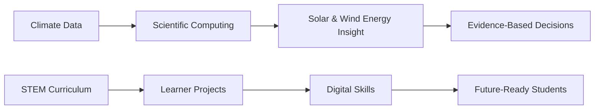

<!--
  Profile README for Babatunde Ayoola Awoyemi
  Designed to be visually rich while remaining readable in GitHub's Markdown renderer.
-->

<div align="center">
  
</div>

<div align="center">

[](https://git.io/typing-svg)

</div>

<div align="center">
  <a href="mailto:babatundeawoyemi91@gmail.com"></a>
  <a href="https://www.linkedin.com/in/ba-awoyemi/"></a>
  <a href="https://x.com/ba_awoyemi"></a>
  <a href="https://www.instagram.com/ba_awoyemi/"></a>
  <a href="https://web.facebook.com/ba.awoyemi"></a>
  <a href="https://www.threads.com/@ba_awoyemi"></a>
  <a href="https://wa.me/2348126909498"></a>
</div>

<br />

<div align="center">
  
  
  
  
</div>

---

## 👋 Welcome

I am **Babatunde Ayoola Awoyemi** — a **multidisciplinary STEM educator, atmospheric physicist, research-driven problem solver, and EdTech consultant** working at the intersection of **climate science, computational modelling, coding education, robotics, and institutional STEM transformation**.

My work combines rigorous atmospheric physics research with practical education delivery: from modelling **all-sky solar irradiance using satellite datasets** to helping learners build with **Python, Scratch, robotics kits, HTML/CSS, and computational thinking**.

<table>
  <tr>
    <td width="33%">
      <h3 align="center">🌍 Climate Science</h3>
      <p align="center">Solar radiation, aerosols, clouds, climate-energy interactions, remote sensing and renewable energy assessment.</p>
    </td>
    <td width="33%">
      <h3 align="center">🎓 STEM Education</h3>
      <p align="center">Physics, mathematics, coding, robotics, curriculum design, teacher training and learner-centered innovation.</p>
    </td>
    <td width="33%">
      <h3 align="center">💻 Technology</h3>
      <p align="center">Python, MATLAB, Fortran, web fundamentals, data analysis, scientific computing and EdTech program design.</p>
    </td>
  </tr>
</table>

---

## 🧭 Navigation

- [Snapshot](#-snapshot)
- [Research Portfolio](#-research-portfolio)
- [Professional Experience](#-professional-experience)
- [Technology Stack](#-technology-stack)
- [Education](#-education)
- [Certifications, Awards & Leadership](#-certifications-awards--leadership)
- [Collaboration Opportunities](#-collaboration-opportunities)
- [GitHub Analytics](#-github-analytics)
- [Connect](#-connect)

---

## ⚡ Snapshot

```yaml
name: Babatunde Ayoola Awoyemi
location: Nigeria
roles:
  - Physics & Mathematics Teacher, Oyo State TESCOM
  - Lead Consultant, Techbase Consultant Services
  - STEM Educator and Curriculum Designer
  - Atmospheric Physics Researcher
research_focus:
  - Solar radiation modelling
  - Aerosol-cloud-radiation interactions
  - Atmospheric remote sensing
  - Renewable energy potential assessment
  - Climate and ecological data solutions
teaching_focus:
  - Physics
  - Mathematics
  - Python and Scratch programming
  - Robotics and physical computing
  - Web development foundations
mission: "Use science, technology and education to build practical solutions for African learners and climate challenges."
```

---

## 🔬 Research Portfolio

### 📘 Parametric Estimation of Direct Irradiance under All-Sky Conditions from Publicly Available Satellite Datasets

**M.Sc. Thesis · University of Ibadan · Published 2020**

> Built a practical, satellite-driven method for estimating all-sky solar radiation in regions with limited ground measurement infrastructure.

| Area | Details |
| --- | --- |
| **Problem** | Reliable solar radiation data are limited in many tropical and developing regions, creating barriers for climate modelling, renewable energy planning and ecological research. |
| **Approach** | Integrated the **Yang Model** with cloud transmittance algorithms using **MODIS Terra/Aqua** and public satellite-derived datasets. |
| **Tools** | Python, MATLAB, Ferret NOAA, MODIS satellite data, NASA SSE products. |
| **Result** | Achieved **19.7% annual RMSD**, outperforming NASA SSE benchmark estimates of approximately **31.5%**. |
| **Impact** | Provides a more accessible pathway for solar resource assessment where ground stations are sparse or unavailable. |

### 🌞 Investigating Solar Dynamics: Unveiling the Intricacies of Solar Structure and Variability

**Undergraduate Research · University of Ibadan**

- Modelled solar structure and variability with computational physics methods.
- Explored magnetohydrodynamics and solar processes using **Fortran**.
- Connected solar variability to broader questions of space weather and Earth-system influence.

### 🌬️ Wind Characteristics and Potentials Using Weibull & Maximum Entropy Models

- Assessed wind energy potential with statistical distribution functions.
- Applied **Weibull** and **Maximum Entropy** methods to characterize wind regimes.
- Reported strong statistical fits with **R² values around 0.90–0.99**, supporting renewable energy feasibility analysis.

---

## 🧪 Research Interests

<div align="center">

| 🌤️ Atmosphere | 🛰️ Remote Sensing | ⚡ Energy | 🌱 Climate Solutions |
| --- | --- | --- | --- |
| Radiative transfer | MODIS workflows | Solar resource assessment | Climate resilience |
| Aerosol-cloud interactions | Satellite data assimilation | Wind-energy potential | Data-scarce regions |
| Greenhouse gas forcing | NASA SSE comparison | Renewable energy planning | Ecological modelling |

</div>

---

## 💼 Professional Experience

### 🏫 Oyo State TESCOM — Physics & Mathematics Teacher

**Jan 2025 – Present**

- Deliver physics and mathematics instruction at **Ilado/Sagbo Community Grammar School**.
- Use problem-based learning, visual explanation, and STEM-oriented instruction to strengthen learner outcomes.
- Integrate science concepts with real-world applications in energy, climate and technology.

### 🧠 Techbase Consultant Services — Lead Consultant & STEM Educator

**April 2022 – Present · RC: BN3570899 · SMEDAN Registered**

- Lead an EdTech consultancy focused on **coding, robotics, physics and mathematics education**.
- Design curricula for **Python, Scratch, web development, physical computing and robotics**.
- Partner with schools including **Baptist Model High Schools** and **Knowledge Base International Schools**.
- Train learners to build Scratch games, HTML/CSS websites, robotics projects and foundational programming solutions.
- Provide teacher training, program design, implementation support and STEM strategy consulting.

### 🏫 Knowledge Base International Schools — STEM Educator

**Jan 2022 – Present**

- Pioneered visual and project-based approaches for Physics and ICT instruction.
- Led digital literacy initiatives, coding bootcamps and science competition preparation.
- Supported student confidence through practical computing and science demonstrations.

### 📊 International Institute of Tropical Agriculture — Data Analyst

**Aug 2015 – Nov 2016**

- Analysed agricultural and climate-related datasets using **SPSS**.
- Supported reporting for climate resilience and agricultural development work across West Africa.

### 🎓 Additional Teaching & Technical Roles

- **NYSC Teacher** — Akwa Ibom State, Nigeria.
- **Presiding Officer** — Independent National Electoral Commission, Akwa Ibom State.
- **Industrial Trainee** — National Institute of Radiation Protection & Research.
- **Industrial Trainee** — Broadcasting Corporation of Oyo State.

---

## 🛠 Technology Stack

<div align="center">

### Scientific Computing & Data


### Web, Coding & EdTech


### Robotics & Physical Computing


### Research Platforms & Datasets


</div>

---

## 🎓 Education

| Degree | Institution | Year |
| --- | --- | --- |
| **M.Sc. Atmospheric Physics** | University of Ibadan, Nigeria | 2019 |
| **B.Sc. Physics** | University of Ibadan, Nigeria | 2014 |

---

## 🏆 Certifications, Awards & Leadership

### Certifications & Professional Development

- **YALI RLC West Africa Leadership Certification** — 2025.
- **Design Thinking** — Australian Computing Academy, Unilever and Cartedo.
- **Web Development** — University of Michigan via Coursera and SoloLearn.
- **Coding Foundations** — SoloLearn.
- **SMEDAN Registered Business Owner** — Techbase Consultant Services.

### Awards & Recognition

- **Best NYSC Teacher** — Akwa Ibom State, 2014/2015.
- **Most Outstanding Worker** — RCCG Oyo Province 3 Youth Church.

### Volunteering & Leadership

- STEM Educator — RCCG Kingdom Diplomats Youth Church.
- Mentor — Education Support Network.
- Volunteer — LEAP Africa Youth Day of Service.
- President — Redeemed Christian Corpers’ Fellowship, 2014–2015.
- Financial Supporter — Healing Lives Initiative.

---

## 🤝 Collaboration Opportunities

I am open to partnerships, research support, speaking engagements, curriculum collaborations and practical STEM programs in the following areas:

<table>
  <tr>
    <td width="50%">
      <h3>🌐 EdTech & Web Learning</h3>
      <ul>
        <li>Student coding bootcamps</li>
        <li>School STEM labs and clubs</li>
        <li>Introductory web development programs</li>
        <li>Scratch, Python and robotics curricula</li>
      </ul>
    </td>
    <td width="50%">
      <h3>🌍 Climate & Energy Research</h3>
      <ul>
        <li>Solar radiation modelling</li>
        <li>Renewable energy potential studies</li>
        <li>Remote-sensing workflows</li>
        <li>Climate data analysis for data-scarce regions</li>
      </ul>
    </td>
  </tr>
</table>

---

## 📊 GitHub Analytics

<div align="center">
  
  
</div>

<div align="center">
  
</div>

<div align="center">
  
</div>

---

## 📌 Featured Value Proposition

> I help schools, learners and institutions move from **technology awareness** to **technology creation** — while applying climate science and computational research to real-world African development challenges.

<div align="center">



</div>

---

## 📫 Connect

<div align="center">

| Channel | Link |
| --- | --- |
| 📧 Email | [babatundeawoyemi91@gmail.com](mailto:babatundeawoyemi91@gmail.com) |
| 💬 WhatsApp | [+234 812 690 9498](https://wa.me/2348126909498) |
| 💼 LinkedIn | [ba-awoyemi](https://www.linkedin.com/in/ba-awoyemi/) |
| 🐦 X | [@ba_awoyemi](https://x.com/ba_awoyemi) |
| 📸 Instagram | [@ba_awoyemi](https://www.instagram.com/ba_awoyemi/) |
| 🧵 Threads | [@ba_awoyemi](https://www.threads.com/@ba_awoyemi) |

</div>

---

<div align="center">
  
</div>

<div align="center">
  <strong>“What ultimately matters is not where you end up relative to others, but where you end up relative to yourself when you began.”</strong>
</div>
